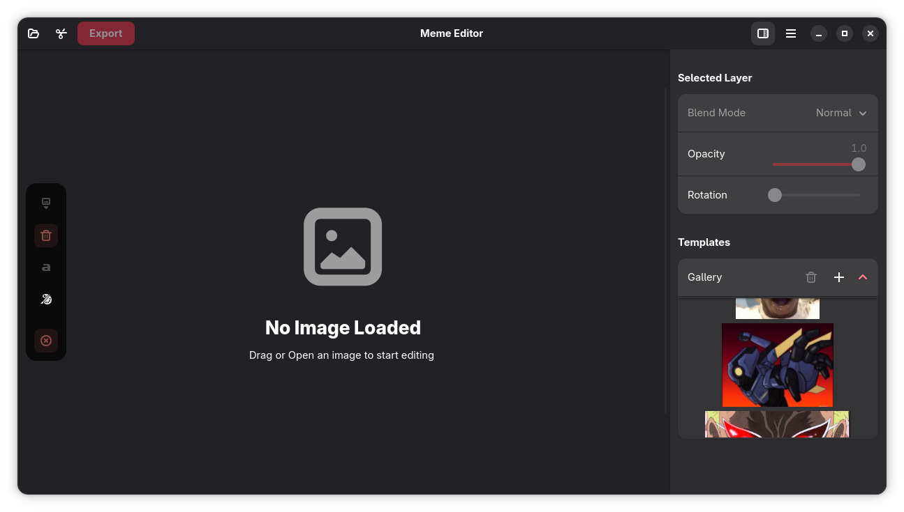
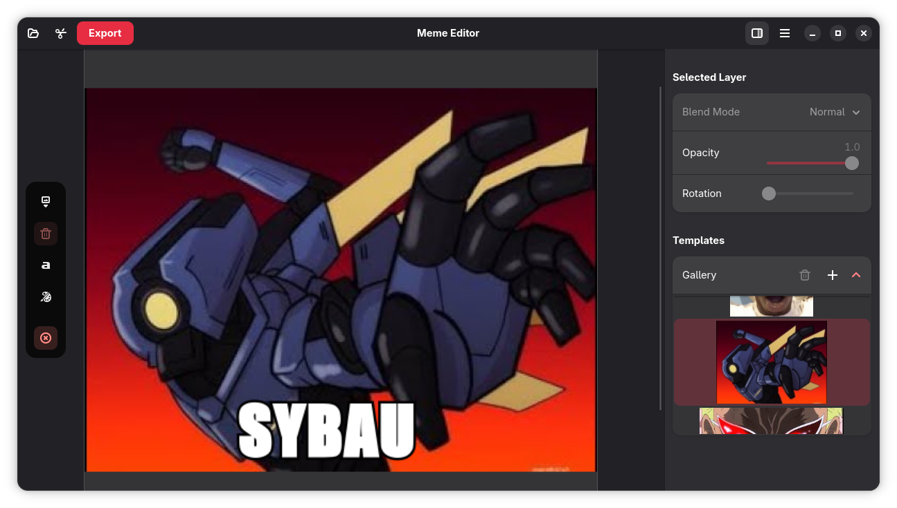
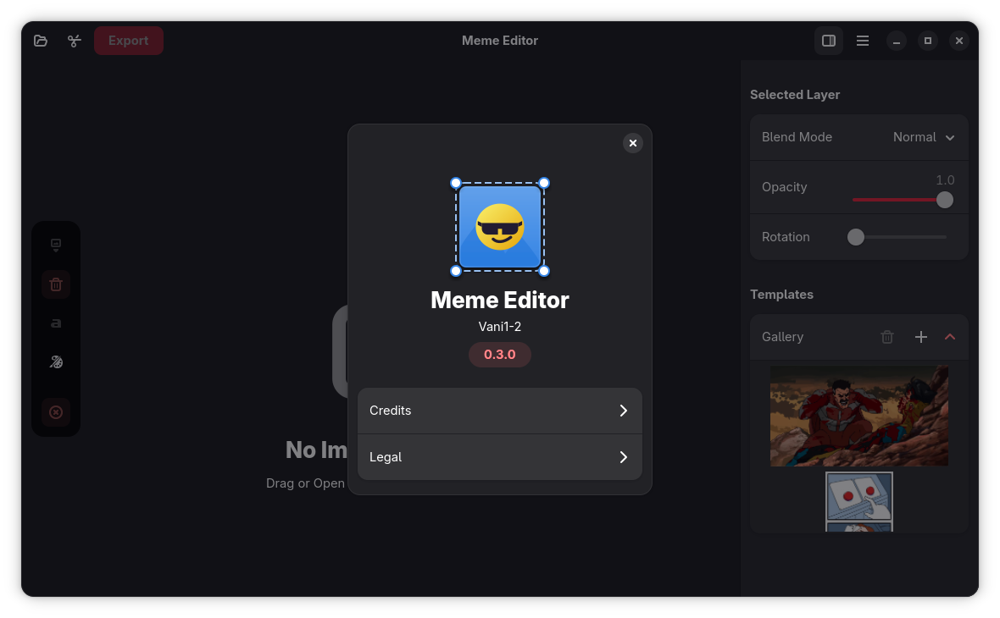

# Memerist

<p align="center">
  
</p>

<p align="center">
  <strong>Memes go BRRRRRRRRRRRRR</strong>
</p>

<p align="center">
  A modern meme editor built with GTK 4 and Libadwaita.
</p>

<p align="left">
  <a href="https://copr.fedorainfracloud.org/coprs/vaniiiiii/memerist">
    
  </a> 
</p>

[](https://copr.fedorainfracloud.org/coprs/vaniiiiii/memerist/package/memerist/)


---

## Features
- **Use or Import your own Templates** 
- **Image Import** - Load any image to use as your meme template
- **Classic Meme Text** - You can drag the text anywhere in the photo
- **PNG Export** 
- **Layers** - Import any images as another layer to the base image
- **Native GNOME Design**
- **Let it Happen**

## Screenshots

<p align="center">
 
</p>
<p align="center">
 
</p>
<p align="center">
 
</p>


## Installation

### Fedora and other RPM based distros
Install latest build using Copr( Supports amd64 & aarch64 ):
    
```bash
sudo dnf copr enable vaniiiiii/memerist 
sudo dnf install memerist
```
### Debian/Ubuntu

Add the dedicated repository to your sources:
[**APT Repository**](https://vani-tty1.github.io/vani-pkgs)


### Arch Linux and derivatives
You arch users know this, its very simple.
```bash
curl -SL https://raw.githubusercontent.com/vani-tty1/memerist/main/scripts/install-archlinux.sh | bash
```


## Building from Source

#### Prerequisites

Install the required development packages:

**Fedora/RHEL:**
```bash
sudo dnf install gtk4-devel libadwaita-devel meson ninja-build
```

**Ubuntu/Debian:**
```bash
sudo apt install libgtk-4-dev libadwaita-1-dev meson ninja-build
```

#### Build Instructions

```bash
# Clone the repository
git clone https://github.com/vani-tty1/memerist.git
cd memerist

# Configure the build
make setup

# Compile
make build

# Reconfigure build folder
make reconfigure

# Install (optional)
sudo meson install -C build
```

#### Running Without Installing

```bash
make run
```

##  Usage

1. Launch Memerist from your application menu
2. Click the folder button to browse images using your file browser
3. Enter your text, you can drag the text anywhere in the photo viewport
4. Export your meme as PNG
5. Let it Happen

## Contributing

Contributions are welcome! Feel free to open issues or submit pull requests.

## License

This project is open source. Please check the LICENSE file for details.

## Acknowledgments

Built with GTK4 and Libadwaita.


